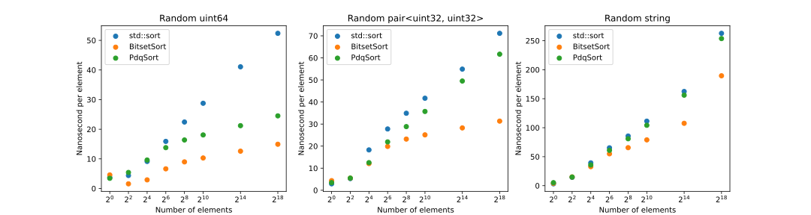
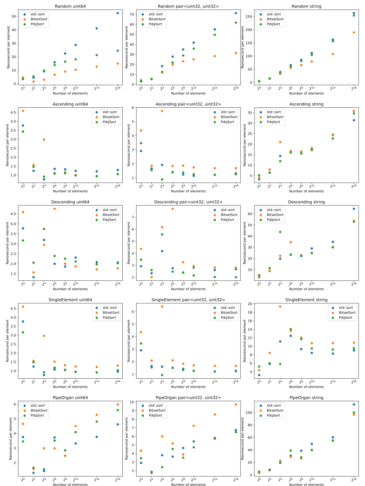
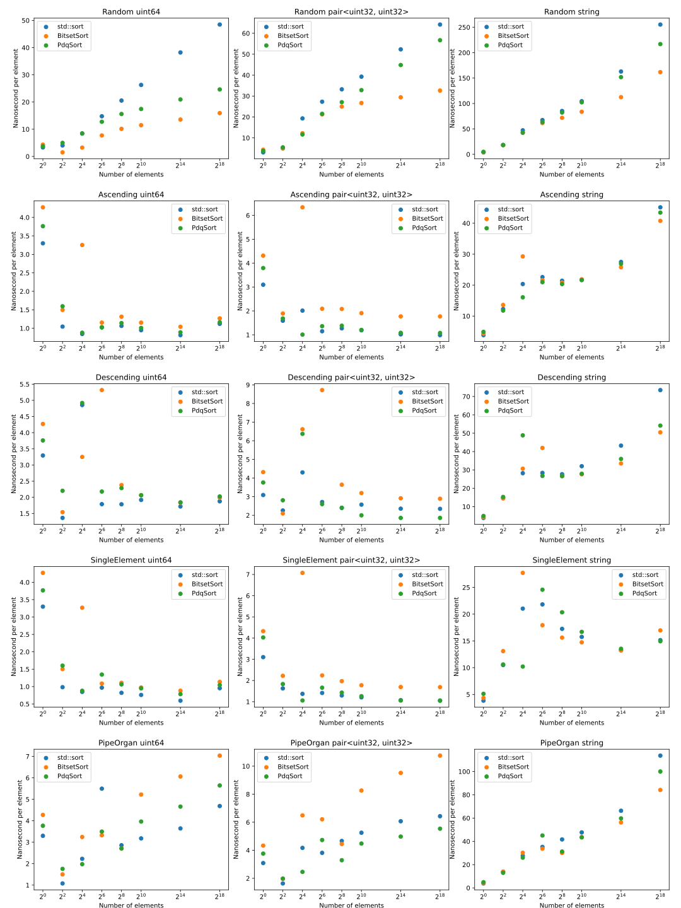

# Bitset Sort

Bitset Sort is a variant of quick sort, specifically [BlockQuickSort](https://dl.acm.org/doi/fullHtml/10.1145/3274660). Bitset Sort uses a carefully written partition function to let the compiler generate SIMD instructions without actually writing SIMD intrinsics in the loop.



Bitset Sort is interface compatible with std::sort and meant to replace `std::sort` in libc++.

Bitset Sort is 3.4x faster (or spends 71% less time) than libc++ `std::sort` when sorting uint64s and 1.58x faster (or spends 37% less time) when sorting `std::string`.

Bitset Sort uses multiple techniques to improve runtime performance of sort. This includes sorting networks, a variant of merge sort called Bitonic Order Merge Sort that is faster for small N, and pattern recognitions.

## Improvement Highlights

Bitset Sort recognizes 3 key areas in a generic quick sort algorithm to improve sorting performance.
- Block Partition
- Small sort
- Pattern recognition

### Block Partition

A typical quick sort algorithm has the following partition loop. For randomized input data, the outcome of comparison has 50-50 chance of true or false therefore a hardware branch predictor cannot be effective.

```
        while (first < last) {
            std::iter_swap(first, last);
            while (comp(*++first, pivot));
            while (!comp(*--last, pivot));
        }
```
(excerpt from [pdqsort.h](https://github.com/orlp/pdqsort/blob/master/pdqsort.h))

BlockQuickSort almost eliminates branch predictions in the quick sort by doing comparisons in a block and swaps elements in a batch.

```
  ...
     for i = 0, ... , B − 1 do
       offsetsL[numL] ← i
       numL += (pivot ≥ A[l + i])
     end for
  ...
  num = min(numL, numR)
  for j = 0, . . . , num − 1 do
    swap(A[l] + offsetsL[startL + j], A[r − offsetsR[startR + j])
  end for
```
(excerpt from [BlockQuickSort Algorithm 3](https://dl.acm.org/doi/fullHtml/10.1145/3274660))

This loop will make B comparisons in a single for-loop and store offsets only when the comparison returns true (pivot >= A[l + i]). This loop does not have a branch but a data dependency on variable numL. Swaps can be done in a batch without a branch.

Bitset Sort improves the above partition function by using a bitset (64 bit set) which allows the C++ compiler to generate SIMD instructions.

```
    for (int __j = 0; __j < _Bitset::__block_size;) {
        __left_bitset |= (static_cast<__storage_t>(__comp(__pivot, *__iter)) << __j);
        __j++;
        __iter++;
    }
```
(excerpt from bitsetsort.h)

This loop is very similar to the BlockQuickSort except that it does not have a data dependency on any variable. It deterministically stores a comparison result into a bitset (a single 64-bit integer).

For a block size of 8, 16, 32, and 64, this for-loop can be compiled into an unrolled loop of SIMD instructions.

To see the unrolled loop in action, the following is the generated code of the Bitset partition function by Clang++ 12.

`clang++12 -O3 -march=znver3 -stdlib=libc++`

```
.LBB4_16:                               #   in Loop: Header=BB4_15 Depth=1
        vmovdqu xmm2, xmmword ptr [r13]
        vmovdqu xmm3, xmmword ptr [r13 + 16]
        vmovdqu xmm4, xmmword ptr [r13 + 32]
        vpcmpgtd        xmm2, xmm2, xmm0
        vpcmpgtd        xmm3, xmm3, xmm0
        vpcmpgtd        xmm4, xmm4, xmm0
        vpmovzxdq       ymm2, xmm2              # ymm2 = xmm2[0],zero,xmm2[1],zero,xmm2[2],zero,xmm2[3],zero
        vpmovzxdq       ymm3, xmm3              # ymm3 = xmm3[0],zero,xmm3[1],zero,xmm3[2],zero,xmm3[3],zero
        vpand   ymm2, ymm2, ymmword ptr [rip + .LCPI4_0]
        vpand   ymm3, ymm3, ymmword ptr [rip + .LCPI4_1]
        vpmovzxdq       ymm4, xmm4              # ymm4 = xmm4[0],zero,xmm4[1],zero,xmm4[2],zero,xmm4[3],zero
        vpand   ymm4, ymm4, ymmword ptr [rip + .LCPI4_2]
        vpor    ymm2, ymm3, ymm2
        vmovdqu xmm3, xmmword ptr [r13 + 48]
        vpcmpgtd        xmm3, xmm3, xmm0
        vpmovzxdq       ymm3, xmm3              # ymm3 = xmm3[0],zero,xmm3[1],zero,xmm3[2],zero,xmm3[3],zero
        vpand   ymm3, ymm3, ymmword ptr [rip + .LCPI4_3]
        vpor    ymm3, ymm4, ymm3
        vmovdqu xmm4, xmmword ptr [r13 + 80]
        vpor    ymm2, ymm2, ymm3
        vmovdqu xmm3, xmmword ptr [r13 + 64]
        vpcmpgtd        xmm4, xmm4, xmm0
        vpcmpgtd        xmm3, xmm3, xmm0
        vpmovzxdq       ymm4, xmm4              # ymm4 = xmm4[0],zero,xmm4[1],zero,xmm4[2],zero,xmm4[3],zero
        vpmovzxdq       ymm3, xmm3              # ymm3 = xmm3[0],zero,xmm3[1],zero,xmm3[2],zero,xmm3[3],zero
        vpand   ymm4, ymm4, ymm6
        vpand   ymm3, ymm3, ymm5
        vpor    ymm3, ymm3, ymm4
        vmovdqu xmm4, xmmword ptr [r13 + 96]
        vpcmpgtd        xmm4, xmm4, xmm0
...
```        

### Small sort

Quicksort has a higher overhead for sorting smaller arrays. Many practical implementations use a simpler sort algorithm such as insertion sort when dealing with smaller arrays.

Bitset Sort uses a sorting network (Batcher sorting network) and Bitonic Order Merge Sort for smaller arrays. For N <= 8, it uses a conditional move-based sorting networks. For N > 8 and N <= 32, it uses Bitonic Order Merge Sort for faster sorting.

#### Bitonic Order Merge Sort
Bitset Sort uses Bitonic Order Merge Sort for N <= 32 as it is faster than insertion sort or other small sorts. Bitonic Order Merge Sort deserves a separate document but we will only explain the fundamental ideas for the sake of this document.

A bitonic order is a sequence of ascending sorted arrays followed by descending sorted arrays.

Example.
```
[1 5] [6 2] [3 10] [5 4]
```

A typical merge of two sorted arrays would require 3 comparisons for each element. See the following code.
```
// Merges a[lstart..lend] and a[rstart..rend] into b[out...]
l = lstart;
r = rstart;
while (l < lend && r < rend) {
    if (a[l] < a[r]) {
        b[out++] = a[l++];
    } else {
        b[out++] = a[r++];
    }
}
// Copies remainder of a[l..lend] or a[r..rend] to b[out...]
```
It requires 1) a boundary check on l, 2) a boundary check on r, 3) a comparison on element.

If an array is bitonic order, it can replace two boundary checks by a single for-loop. Typically, a for-loop is better executed in modern environments as it is more heavily optimized in both compilers and processors.
```
// Merges a[lstart..lend] and a[rstart..rend] into b[out...], assuming len = total number of elements to be merged.
l = lstart;
r = rend-1;
for (int i = 0; i < len; i++) {
    if (a[l] < a[r]) {
        b[out++] = a[l++];
    } else {
        b[out++] = b[r--];
    }
}
```

You might wonder what would happen if l reaches lend or r reaches rstart.

```
[1 5 7 10] [1000 900 800 700]
 ^                       ^
 l                       r

 out = [1]

[1 5 7 10] [1000 900 800 700]
   ^                     ^
   l                     r

out = [1 5]

[1 5 7 10] [1000 900 800 700]
     ^                   ^
     l                   r

out = [1 5 7]

[1 5 7 10] [1000 900 800 700]
       ^                 ^
       l                 r

out = [1 5 7 10]

[1 5 7 10] [1000 900 800 700]
            ^            ^
            l            r

out = [1 5 7 10 700]
```
The edge case is nicely handled because a[l] is the largest element on the right hand-side. It works similarly when r crosses over to the left hand-side.


### Pattern Recognition

[PdqSort](https://github.com/orlp/pdqsort) nicely integrated a pattern recognition for ascending, descending, pipe organ, and single element patterns into the quick sort function. By carefully picking pivots and partitioning arrays, PdqSort does not mix up already sorted arrays like a simple quick sort.

Bitset Sort adopts the idea of PdqSort partially to exhibit O(n) behavior for known patterns. It might be possible to exploit more known patterns but the author does not intend to optimize these patterns any further at this point. This is the author's belief that real world workload resembles randomized inputs rather than a few simple patterns.

# Test Result

There are two setups.

Ryzen 5950X
- AMD Ryzen 5950X 3.4G 16 core processor (Zen 3 architecture). Precision Boost Overdrive (an overclocking feature) is turned off for a stable result.
- Ubuntu 20.04 LTS under Windows Subsystem for Linux 2 in Windows 10.
- clang-12 deb packages for Ubuntu 20.04. (https://apt.llvm.org/)

Intel E5 1650
- Intel E5 1650 3.6G 12 core processor (Broadwell architecture). Dynamic frequency scaling is turned off.
- Debian Linux
- clang-12 pre-built packages.

The graph shows time spent per element. It is expected to follow O(n log2 n).

## AMD Ryzen 5950x (Zen 3)


## Intel E5 1650 (Broadwell)


Bitset Sort performs better than PdqSort and std::sort in randomized inputs.

Bitset Sort performs worse in a few patterns in a few sizes. Please note the absolute timescale. Compared to the randomized inputs, these were a few nanosecond per element.

# Acknowledgements

BLockQuickSort deserves much more attention than it has. BlockQuickSort trail-blazed a new way of sorting.

PdqSort improved BlockQuickSort with various ideas, making it very practical implementation.

Bitset Sort implementation took PdqSort as a motivational example, reimplemented the partition function and various part of the code. The author acknowledges PdqSort's neat implementation and various techniques to improve sorting performance.

# References

1. BlockQuickSort, Stefan Edelkamp and Armin Weiß, https://dl.acm.org/doi/fullHtml/10.1145/3274660
1. PdpSort, Orson Peters, https://github.com/orlp/pdqsort
